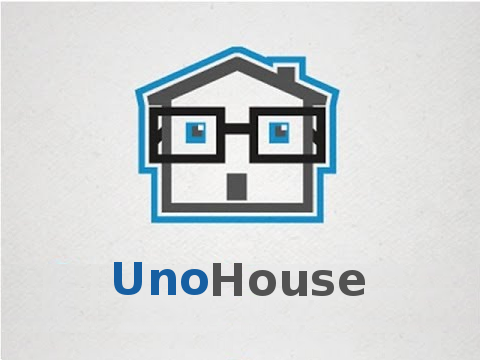

# UnoHouse

Projekt ma na celu pokazanie jak różne jezyki programowania moga wpłynąć na środowisko dookoła nas.
Dzięki połączeniu mikro-urządzeń do sterowania procesami domu oraz z aplikacją mobilna i przeglądarkową, mozliwe jest zdalne zarządzanie swoim domem.
Oprogramowanie to powstaje w celu przedstawienia sposobu komunikacji oraz współpracy zupełnie różnych technologii.
Dzięki temu możemy z łatwościa, sprawdzić czy nasz dom jest bezpieczny, oraz czy nie doszło do żadnych niespodziewanych wypadków, jak pożar.
Jeżli np. zapomnimy wyłączyć żelazko, zamiast wracać do domu, możemy w danym pomieszczeniu odłączyć prąd w gniazdkach.

## Technologie:

- [Docker](https://www.docker.com/)
- [Nginx-proxy](https://hub.docker.com/r/jwilder/nginx-proxy/) 
- [Apache HTTPd](https://hub.docker.com/r/webdevops/php-apache/)
- [PHP-FPM (7.0) (with Xdebug)](https://hub.docker.com/r/webdevops/php-apache/)
- [MySQL](https://hub.docker.com/_/mysql/)
- [ELK, Elasticsearch, Logstash, Kibana](https://hub.docker.com/r/willdurand/elk/)
- [Redis (wylączony)](https://hub.docker.com/_/redis/)
- [Memcached](https://hub.docker.com/_/memcached/)
- [PhpMyAdmin Docker](https://hub.docker.com/r/phpmyadmin/phpmyadmin/)
- [Jenkins](https://jenkins.io/)

## Dokumentacja
- [Projekt](/documentation/pl/Projekt/README.md)
- [Dokumentacja Techniczna](/documentation/pl/Tech/README.md)
- [Docker](/documentation/pl/Docker/README.md)
- [PHP](/documentation/pl/PHP/README.md)
- [Mikrokontroler (C/C++)](/documentation/pl/Mikrokontroller/README.md)
- [Mikroprocesor(Java)](/documentation/pl/Mikroprocesor/README.md)
- [Android](/documentation/pl/Android/README.md)
- [Frontend](/documentation/pl/Frontend/README.md)